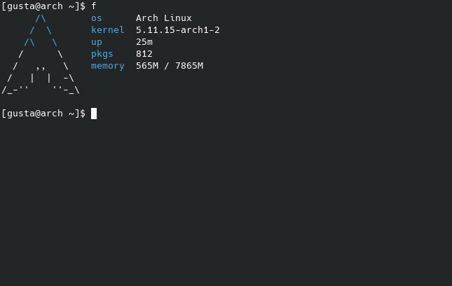

# f

Fast and simple system info (for Linux) written in POSIX compliant C99.

## Build

Dependencies:

+ make
+ gcc (and a POSIX environment)
+ procps

```
$ make
```

## Install

```
# make install
```

## Uninstall

```
# make uninstall
```

## Screenshot



## Supported distros

+ Arch Linux
+ Debian
+ Fedora
+ Linux Mint
+ Manjaro
+ OpenSUSE
+ Pop!_OS
+ Ubuntu

## License

The MIT License (MIT)

f Copyright (c) 2021 Gustavo Costa
