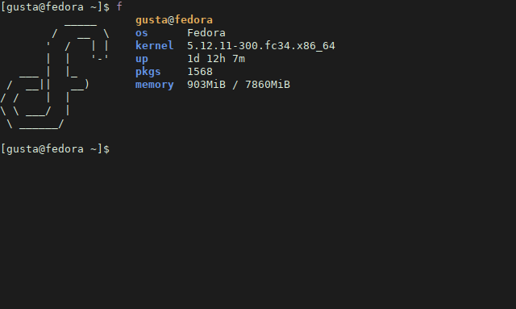

# f

Fast and simple system info (for Linux) written in POSIX compliant C99.

## Installation

#### Requirements

+ make
+ gcc (and a POSIX environment)

Build and install with:

```
git clone https://github.com/xfgusta/f.git
cd f
make
```

And then `make install` as root.

To uninstall, run `make uninstall` as root as well.

## Screenshot



## Supported distros

+ Arch Linux
+ Debian
+ Fedora
+ Linux Mint
+ Manjaro
+ OpenSUSE
+ Pop!_OS
+ Ubuntu

## License

The MIT License (MIT)

Copyright (c) 2021 Gustavo Costa
